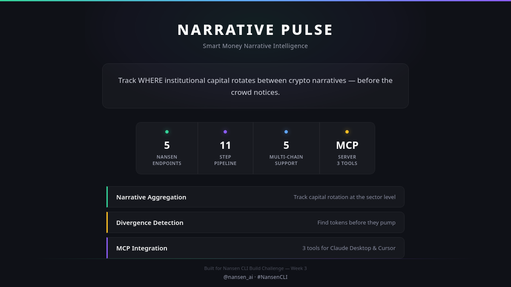
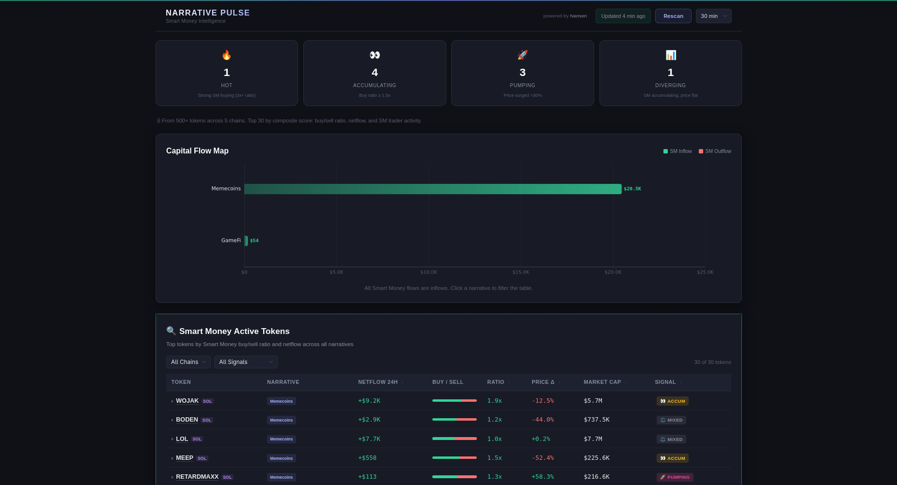
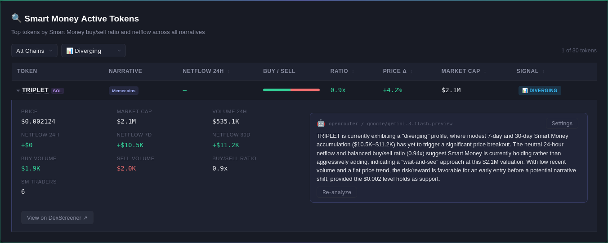

# Narrative Pulse

> **Track WHERE smart money rotates between crypto narratives — before the crowd notices.**

[](https://x.com/nansen_ai/status/2033508720592949417)
[](https://www.typescriptlang.org/)
[](./LICENSE)
[](#)

<p align="center"></p>

## What it does

Narrative Pulse aggregates Nansen smart-money data at the **narrative level**, not individual tokens. It fuses 5 Nansen API endpoints with DexScreener enrichment into a pipeline that shows where capital is rotating between crypto narratives — DeFi, AI, RWA, Memecoins, and beyond.

The result: instead of 500+ tokens with positive netflow (noise), you get a ranked view of which narratives are heating up, which are cooling down, and which tokens show smart-money accumulation **before price moves**.

## Screenshots

<table>
  <tr>
    <td align="center"><b>Live Dashboard</b></td>
    <td align="center"><b>Expanded Token + AI Analysis</b></td>
  </tr>
  <tr>
    <td></td>
    <td></td>
  </tr>
</table>

## Key Features

1. **Narrative-Level Aggregation** — groups tokens by Nansen sectors so you see "AI Agents +$2.1M" instead of 15 individual tickers.

2. **Divergence Detection** — finds tokens where smart money is accumulating but price hasn't moved yet (buy/sell ratio > 1.5x, price change < 5%).

3. **Flow Intelligence** — breaks down capital flows for top tokens into 6 segments: Smart Traders, Whales, Exchanges, Fresh Wallets, Public Figures, Top PnL.

4. **AI Analysis (BYOK)** — per-token LLM insights via OpenAI, Anthropic, OpenRouter, or any OpenAI-compatible endpoint. Keys stored locally in browser only.

5. **MCP Server** — 3 tools for Claude Desktop / Cursor integration.

6. **Live Dashboard** — dark-themed web UI with ECharts charts, sortable tables, auto-refresh, and one-click scan triggers.

## How to run

```bash
git clone https://github.com/andrei-zakharov/narrative-pulse.git
cd narrative-pulse && npm install
export NANSEN_API_KEY=<your-key>
npx tsx src/index.ts scan
```

For the live dashboard:

```bash
npx tsx src/index.ts serve  # http://localhost:3000
npx tsx src/index.ts serve --port 8080
```

## Pipeline

```
Nansen API (5 endpoints) + DexScreener (free)
                    │
              11-Step Pipeline
                    │
    Terminal │ HTML Report │ Live Dashboard │ MCP
```

**The pipeline steps** (~300 credits per standard scan):

1. Fetch smart-money netflows (5 chains, paginated)
2. Fetch token-screener data (price, volume, buy/sell)
3. Fetch smart-money holdings (SM portfolio positions)
4. Enrich with DexScreener (free, cached, batched)
5. Discover sectors (unique narrative combinations)
6. Aggregate tokens by narrative (group, sum netflows)
7. Classify tokens (Hot / Accumulating / Diverging / Pumping / Mixed / Selling)
8. Extract top-30 highlights (composite scoring)
9. Fetch flow intelligence (6-segment breakdown, top-5)
10. Compute narrative rotations (delta vs previous scan)
11. Sub-narratives via Agent API (`--deep` flag only)

## CLI Commands

| Command | Description |
|---------|-------------|
| `scan` | One-time intelligence report (terminal + HTML) |
| `serve` | Live dashboard at `localhost:3000` |
| `watch` | 24/7 cron monitoring (`--schedule "0 */2 * * *"`) |
| `mcp` | MCP server for AI agents (stdio transport) |
| `sectors` | List all discovered narratives |

## MCP Integration

Add to your Claude Desktop config (`~/Library/Application Support/Claude/claude_desktop_config.json`):

```json
{
  "mcpServers": {
    "narrative-pulse": {
      "command": "npx",
      "args": ["-y", "tsx", "src/index.ts", "mcp"],
      "env": {
        "NANSEN_API_KEY": "your-key-here"
      }
    }
  }
}
```

| Tool | Returns |
|------|---------|
| `get_narrative_scan` | Full scan summary — all narratives, netflows, hot flags |
| `get_hot_tokens` | Top tokens from hottest narrative with classification |
| `get_early_signals` | Tokens with SM accumulation before price moves |

Results are cached for 5 minutes to avoid redundant API calls.

## Tech Stack

TypeScript 5.5 (strict, ESM) · Express 5 · ECharts · MCP SDK · chalk 5 · Zod · node-cron · Commander.js 12

## Project Structure

```
src/
├── index.ts              # CLI entry (scan, watch, sectors, serve, mcp)
├── types.ts              # All TypeScript interfaces
├── config.ts             # Chains, thresholds, API config
├── api/
│   ├── client.ts         # Nansen HTTP client (auth, retry, rate limit)
│   ├── netflows.ts       # smart-money/netflows (5 chains, paginated)
│   ├── token-screener.ts # token-screener enrichment
│   ├── holdings.ts       # smart-money/holdings
│   ├── flow-intelligence.ts  # 6-segment participant breakdown
│   ├── agent.ts          # agent/fast (SSE, sub-narratives)
│   └── dexscreener.ts    # DexScreener (free, cached, batch 30)
├── engine/
│   ├── scanner.ts        # 11-step pipeline orchestrator
│   ├── discovery.ts      # Sector discovery
│   ├── aggregator.ts     # Narrative aggregation
│   ├── classifier.ts     # Token classification
│   ├── enricher.ts       # Merge Nansen + DexScreener + early signals
│   ├── screener-highlights.ts  # Top-30 SM active tokens
│   ├── sub-narratives.ts # Agent API sub-narrative analysis
│   └── rotations.ts      # Narrative rotation tracking
├── visual/
│   ├── html-report.ts    # Static HTML with ECharts
│   ├── terminal-report.ts # CLI output (chalk + cli-table3)
│   └── dashboard.ts      # Dynamic HTML dashboard (JSON API)
├── server/
│   └── index.ts          # Express server + AI analysis proxy
├── mcp/
│   └── server.ts         # MCP server (stdio, 3 tools)
├── scheduler/
│   └── cron.ts           # 24/7 cron mode
└── utils/
    └── normalize.ts      # Address normalization (EVM + Solana)
```

## License

MIT
